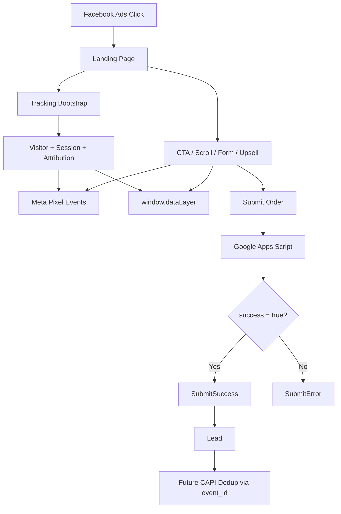

# Tracking Architecture

## Event Flow

1. Visitor vao landing page, `Tracking` khoi tao `visitor_id`, `session_id`, attribution, `_fbp`, `_fbc`, va `window.dataLayer`.
2. `ViewContent` ban mot lan khi trang boot xong.
3. Cac tuong tac dau funnel duoc track bang Pixel + dataLayer:
   - Scroll depth `25`, `50`, `75`, `90`
   - CTA click
   - Contact click
   - View offer
   - Form view
   - Form start
   - Phone input
   - Address input
   - Combo change
   - Add to cart
   - Upsell view/add/remove
   - Submit click
4. Submit form gui sang Google Apps Script bang `fetch(..., { mode: "cors" })`.
5. Chi khi Apps Script tra ve JSON co `success: true`:
   - UI success state moi hien thi
   - `SubmitSuccess` moi ban
   - `Lead` moi ban
6. `Purchase` chi de san ham `Tracking.trackPurchase()` cho Conversion API ve sau, khong duoc goi tu Pixel.

## Event Diagram

## Shared Payload

Tat ca event deu co:

- `event_id`
- `timestamp`
- `page`
- `page_url`
- `fbclid`
- `fbc`
- `fbp`
- `visitor_id`
- `session_id`
- `first_visit`
- `utm.source`
- `utm.medium`
- `utm.campaign`
- `utm.content`
- `utm.term`
- `landing_page`
- `referrer`
- `device`
- `browser`
- `screen_size`
- `timezone`
- `language`

## Event Payloads

### `ViewContent`

- `content_name`
- `content_type`

### `ScrollDepth`

- `scroll_percent`

### `CTA_Click`

- `button_name`
- `section`
- `page_position`
- `destination`

### `Contact`

- `channel`
- `button_name`
- `section`

### `ViewOffer`

- `section`
- `offer_type`

### `FormView`

- `section`
- `page_position`

### `FormStart`

- `field_name`

### `FormFieldInput`

- `field_name`
- `field_value_state`

### `ComboChange`

- `combo`
- `value`
- `quantity`

### `AddToCart`

- `value`
- `currency`
- `num_items`
- `combo`
- `product_id`
- `product_name`

### `Upsell`

- `upsell_action`
- `product_id`
- `product_name`
- `value`
- `section`

### `SubmitClick`

- `value`
- `currency`
- `combo`
- `num_items`

### `SubmitSuccess`

- `value`
- `currency`
- `combo`
- `num_items`

### `SubmitError`

- `reason`

### `Lead`

- `value`
- `currency`
- `product_id`
- `product_name`
- `quantity`
- `combo`
- `num_items`

## Pixel Flow

- Pixel bootstrap van dung snippet Meta hien co trong `index.html`.
- Tracking layer moi goi `fbq(..., { eventID })` cho tat ca event da map.
- Dedupe duoc dam bao theo session bang `sessionStorage` + in-memory cache.
- `Lead` la event optimize chinh cho giai doan hien tai.
- `Purchase` khong ban tu trinh duyet.

## CAPI Flow

Luong de xuat cho buoc tiep theo:

1. Google Apps Script nhan payload form.
2. Apps Script hoac backend trung gian tao server event `Purchase` hoac `QualifiedLead`.
3. Server event dung lai:
   - `event_name`
   - `event_id`
   - `fbp`
   - `fbc`
   - `client_ip_address`
   - `client_user_agent`
   - `external_id` hoac phone hash
4. Gui len Meta Conversion API de dedup voi Pixel neu sau nay co browser event tuong ung.

## Extensibility

- Them event moi bang cach mo rong `window.Tracking` trong [js/tracking-meta.js](/E:/Dữ liệu%20Sadu/Landingpage/sadu-mate-static-html-css-js/js/tracking-meta.js).
- Shared context nam o:
  - [js/tracking-utils.js](/E:/Dữ liệu%20Sadu/Landingpage/sadu-mate-static-html-css-js/js/tracking-utils.js)
  - [js/tracking-storage.js](/E:/Dữ liệu%20Sadu/Landingpage/sadu-mate-static-html-css-js/js/tracking-storage.js)
  - [js/tracking-session.js](/E:/Dữ liệu%20Sadu/Landingpage/sadu-mate-static-html-css-js/js/tracking-session.js)
- Event envelope va logger nam o [js/tracking-core.js](/E:/Dữ liệu%20Sadu/Landingpage/sadu-mate-static-html-css-js/js/tracking-core.js).
- Co the bat logger bang `?tracking_debug=1`.
- GTM, GA4, Clarity ve sau co the doc cung 1 nguon tu `window.dataLayer`.
